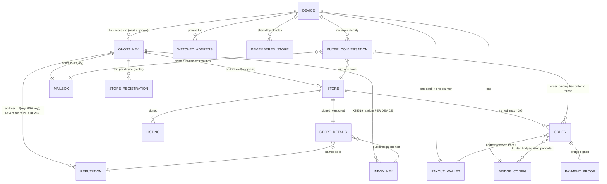
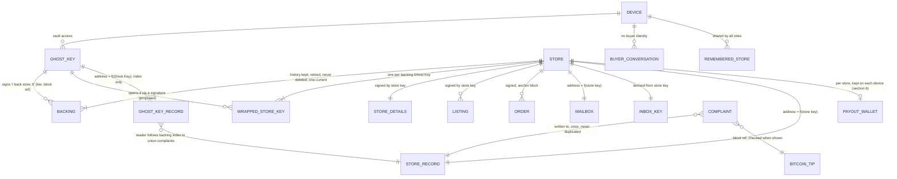

# Harvest: what the entities are, and how the UI should show them

> **Status: the approved revision-2 design (agreed with Ian, 2026-09-18),
> tracked in [freenet/harvest#93](https://github.com/freenet/harvest/issues/93).**
> This is the design record the revision-2 phases implement. It was drafted
> outside the repository and moved here in phase 1a so it lives with the
> code; where phase 1a had to settle something the design left open, the
> choice is recorded in "Phase 1a: what was built" at the end of this file.

> **Revision 2 (canonical), 2026-09-18, the approved design for
> implementation.** This revision replaces revision 1's decision 1 ("keep one
> store per Ghost Key, and make it structural") and everything that depended
> on it. The replacement decisions were agreed with Ian on 2026-09-18:
>
> - a store has its own identity, a **store key**, and the store code derives
>   from it rather than from a Ghost Key;
> - Ghost Keys **back** a store, and the Ghost Key behind a store can change
>   over time (to raise the stake, or to replace a compromised key);
> - the store's **record follows the store** and never resets with a new
>   Ghost Key;
> - the store key is kept recoverable from any backing Ghost Key (a proposed
>   design, still to be validated);
> - complaints carry a Bitcoin block reference, checked before a complaint is
>   shown.
>
> Revision 1's other recommendations stand: the vocabulary, the navigation
> (Stores / My purchases / My store), the seller's orders inbox, removing the
> Reputation and Payments tabs, a payout wallet per store, dropping the
> always-empty buyer field and the unbound invoice form, and the seller's
> listings view. Wording that assumed "one store per Ghost Key" has been
> changed throughout. Section 6 collects the decisions.
>
> **Section 6 carries decisions** (added 2026-09-18, agreed with Ian). Its
> four original open questions are split into six decisions, plus two more
> added in the same pass (no contract may check another contract's state; a
> complaint is stored once), for eight; each is marked **agreed with Ian,
> 2026-09-18**, and keeps the alternatives it beat and what would change it.
> Where a decision alters something stated earlier (the backing rule, the
> custody checks, the payout wallet, the aging and paid-sales lines in the
> wireframes), that place has been updated and points back to section 6.

Revision 1 was reviewed against `freenet/harvest` main at `dc3fd45`, the
screenshots in `~/code/tmp/harvest-screenshots/` (numbered set, `linktest/`,
`mystore-v2/`), and issue #79 with the open issue list. Revision 2's code
references were checked against main at `03c082e` (after #91, short store
codes). 2026-09-18.

## Simplifications, 2026-09-18

Agreed with Ian in the same discussion that produced revision 2's decisions.
Each is integrated throughout the document below; this list is the index.

1. **Drop aging of complaints.** Complaints show as a plain list and count,
   with no recent/older split and no weighting; the block reference (height
   and hash) stays in every complaint. *Why:* once complaints never drop out
   of standing, aging is only a display choice with no evidence buyers need
   it, and it adds UI and logic for a benefit nobody has asked for. The field
   keeps a later client-only aging feature possible without a re-key.
2. **No related-contracts mechanism, anywhere.** Contracts never check
   another contract's mutable state; readers do that instead. *Why:* gating
   a contract's validation on another contract's state breaks convergence,
   whatever the two contracts are.
3. **Defer several Ghost Keys backing one store at once.** One current
   backing; raising the stake means retiring the old key and adding the new
   one. *Why:* avoids tier sums, "current" semantics with several keys, and
   entanglement with #8 before it lands; the contract shape does not change,
   so allowing several backings later is a rule change, not a re-key.
4. **Store each complaint once, at the store.** The Ghost Key record becomes
   a minimal index of the stores a key has backed; a key's complaint history
   is computed by following that index. *Why:* removes the double write and
   the question of what happens when two copies disagree.
5. **Move structured listing prices out of this revision.** Sats, fiat
   display, and invoice prefill move to the #79 pricing work. *Why:* it
   isn't part of the entity-model problem.

## The recommendation in one screen

**A store is the seller. Stop showing "identities" at all.**

The confusion Ian saw ("My Store", then "Your Identities", then an identity
card with a Create Store button) comes from the UI showing the *signing key* as
the main object and the store as an attachment to it. Users should see it the
other way round, and so should the data model:

- **Your store** is the thing a seller has, runs, and shares. It has a name,
  listings, orders, a record, a link, and its own key. The short store code in
  the link comes from the store's key.
- **A Ghost Key backs the store.** It is proof of stake, shown as one line on
  the store's page for both seller and buyer: "Backed by a $100 Ghost Key since
  September; previously a $20 Ghost Key." A seller can change the Ghost Key
  behind a store (a bigger donation, or a key that leaked) without losing the
  store's name, link, listings or history.
- **The record belongs to the store, for good.** Every complaint ever filed
  against a store stays on its record, whichever Ghost Key was backing it at
  the time. A clean slate means a new store *and* a new Ghost Key.
- A second store is a rare, deliberate act ("open another store").

Model decisions (agreed with Ian, 2026-09-18):

1. **A store has its own identity: a store key.** The 16-character store code
   derives from the store key, not from a Ghost Key.
2. **Ghost Keys back a store, and the backing can change over time.** Each
   backing is a Ghost Key signing "I back store X", with its donation tier.
   One Ghost Key backs one store, and a store has one current backing at a
   time: raising the stake retires the old backing and adds the new one
   (section 6.1, 6.2). Several backings adding up at once is deferred, not
   ruled out; see section 6.1.
3. **The record follows the store and never resets.** Every complaint is
   stored once, at the store. The Ghost Key record is a minimal index of the
   stores a key has backed; a Ghost Key's complaint history is computed by
   following that index to each store's record, so it is always the union of
   them without ever duplicating a complaint (section 6.8).
4. **Keep the store key recoverable from any backing Ghost Key, and derive the
   store's other keys from it** (inbox key, and the record key if one
   survives). Proposed, to be validated (section 3).
5. **Complaints carry a Bitcoin block reference, checked before they are
   shown, and never used to age them.** The client uses the reference only to
   decide whether a complaint is safe to show yet; it does not weight or
   group complaints by age. The field keeps a later, client-only aging
   feature possible without a re-key (section 6.5).

UI decisions (from revision 1, unchanged in substance):

6. **Give the payout wallet to the store, not to the device.**
7. **Top navigation becomes Stores / My purchases / My store.** Reputation and
   Payments stop being top-level tabs; they were never places a user goes.
8. **The seller's inbox and orders live in My store**, as one list of buyer
   threads. Today the seller reads their messages by browsing to their own store
   as if they were a customer and pressing "Contact Seller".

A ninth, general decision applies throughout: **no contract ever checks
another contract's mutable state.** Cross-contract facts (a backing key, a
closed store, a block reference) are checked by readers, never validated
inside a contract. See section 3 and section 6.7.

The top five UI changes, ranked by how much confusion each removes, are in
section 5. Section 6 collects the decisions.

---

## 1. The model as implemented today

This section describes the code as it is, before any of the changes below.

### Entities

| Entity | What it is in the code | Where it lives |
|---|---|---|
| **Ghost Key** | An Ed25519 keypair plus a certificate chaining to Freenet's master key, carrying the donation amount and date. The seller's identity and (per the incentive design) their bond. | Ghost Key vault delegate, on the node. Harvest only gets signatures. |
| **Store** | A contract whose parameters are a 16-character base58 prefix ("store code") of the Ghost Key's public key (#91). The full key is the store's `owner`, held in state. Holds owner key, store details, listings, orders. | Network (`StoreStateV1`). |
| **Store details** | Name, markdown description, certificate PEM, seller fingerprint, reputation contract id, inbox encryption public key. Signed, versioned. | Inside the store (`StoreInfoV1`). |
| **Listing** | Title, description, kind (Sale / Gift / Request), free-text price and currency, date. Signed by the Ghost Key. | Inside the store. |
| **Order / invoice** | An amount in sats, a fresh Bitcoin address, required confirmations, trusted bridges, an anchor block, a status (Awaiting payment, Paid, Payment reversed, Cancelled). Signed by the seller, published before payment. | Inside the store (`OrdersV1`, up to 4096). |
| **Payment proof** | Bridge-signed evidence that the order's address was paid. Moves an order to Paid. | Inside the order. |
| **Mailbox (inbox)** | An open-write contract of padded, encrypted messages. Parameters: the Ghost Key's public key. | Network. |
| **Inbox encryption key** | A long-term X25519 key per Ghost Key. Public half published in store details; secret half in the Harvest delegate. **Generated randomly on each device.** | Harvest delegate, `harvest:x25519_sk:{fp}`. |
| **Buyer conversation** | A buyer's ephemeral X25519 secret for one conversation with one store. The buyer has no identity at all. Exportable as a backup string. | Harvest delegate on the buyer's device. |
| **Reputation contract** | Append-only negative feedback entries validated by the seller's RSA blind-signature key. Each entry carries a `submitted_at` wall-clock time the buyer chooses; it is inside the buyer's entry signature, but nothing can check it. Parameters: RSA public key **and** the Ghost Key. | Network. |
| **Reputation RSA key** | Blind-signing keypair for feedback tokens. **Generated randomly on each device** when "Create Store" is pressed. | Harvest delegate, `harvest:rsa_sk:{fp}`. |
| **Feedback token / transaction record** | The blind-token exchange state. Nothing in the UI calls it; the design it serves is superseded (docs/design/incentive-mechanism.md, #8), and there is no path to file feedback (#53). | Harvest delegate, `harvest:tx:*`. |
| **Store registration** | A per-device cache of (store id, reputation id, mailbox id) per Ghost Key, as a *list*. | Harvest delegate, `harvest:stores:{fp}`. |
| **Payout wallet ("payment key")** | One BIP-84 account xpub, its network, and one address counter. | Harvest delegate, **one per device**, shared by every Ghost Key and store. |
| **Bridge** | The external service that watches a Bitcoin address and publishes signed evidence. One configured per device. | Harvest delegate + an external service. |
| **Watched addresses** | A private list of Bitcoin scripts being watched, including a "watch any address" form. | Harvest delegate, one per device. |
| **Remembered stores** | Store codes this device has opened, with an archived flag. | Harvest delegate, one per device, shared by every Ghost Key and by buying. |
| **Migration marker** | Records a completed contract re-key migration. Pure plumbing. | Harvest delegate. |

### Relationships and cardinalities (today)



In words: **today one Ghost Key is one seller: one store, one mailbox, one
reputation**, all addressed by the key. Listings and orders live inside the
store. The buyer has no identity; a buyer is a set of per-conversation secrets
on one device. The payout wallet, bridge, watch list and remembered stores are
device-wide.

### Things in the implementation that are themselves muddled

These are not UI problems. Each one makes it harder to present a clean model,
and several are cheap to fix only while Harvest is pre-launch.

1. **The store has no identity of its own, so it cannot outlive its Ghost
   Key.** The store's address is a prefix of the Ghost Key, and so are the
   mailbox's and the reputation's. A seller who wants to raise their stake
   from $20 to $100, or replace a key that leaked, has to start a new store at
   a new address: new link, no listings, no history. Meanwhile the client code
   half-assumes the opposite: `my_stores` is
   `HashMap<fingerprint, Vec<StoreRegistration>>`, `IdentityCard` loops over
   "stores" and labels each ("a seller with two stores otherwise gets two
   links"), and `sign_and_submit_listing` silently posts to `stores.first()`.
   The list can only ever hold one real store; its other possible entries are
   stale generations, which `merge_store_registrations` and
   `adopt_migrated_contract_id` exist to paper over.

2. **The seller's facets are not portable, though the Ghost Key is.** The store
   and mailbox addresses are pure functions of the key. The reputation address
   is not: its parameters include an RSA key minted with `OsRng` on whatever
   device pressed "Create Store". The inbox decryption key is also minted
   randomly per device. So a seller who opens Harvest on a second node with the
   same Ghost Key gets the same store address, a *different* reputation
   contract, and a new inbox key that cannot read any earlier message.
   Republishing details from the second device would point the store at a new,
   empty reputation. "One store, one reputation" is true only per device.

3. **Reputation is two designs at once.** The shipped contract is the
   blind-signed-token design that `docs/design.md` itself marks superseded, the
   UI has no way to file an entry (#53), and the delegate's transaction-record
   API is unused. Meanwhile the planned model (#8) is "standing" (donated bond)
   minus complaints and open exposure. The RSA key is therefore a per-device,
   non-portable parameter serving a mechanism that will not ship. And the one
   time field an entry has, `submitted_at`, is whatever the buyer's clock
   said: signed, but not checkable by anyone.

4. **The payout wallet is device-wide while everything else about a seller is
   per store.** Two stores on one device share one xpub and one address
   counter. That contradicts the promise the mystore-v2 draft makes ("Buyers
   cannot tell that the two stores are yours"): the first time the seller's
   wallet spends coins from both stores together, the chain links them, and the
   bridge sees watch requests for both under the same device. It also means
   removing one store's key changes the other's.

5. **Orders carry a buyer identity that does not exist.**
   `Order.buyer_fingerprint` is documented as "Ghostkey fingerprint of the
   buyer", is always empty on the real buy flow (buyers have no Ghost Key), and
   is still offered as an input ("Buyer's Ghost Key fingerprint (optional)") on
   the seller's standalone invoice form. The Payments tab filters "your orders"
   by it, so a buyer's own purchases never appear there.

6. **Two ways to create an invoice with different safety properties.** The
   inbox's "accept request" path binds the order to the buyer's conversation
   (`order_binding`), which is what the buyer's software checks before paying.
   The "Issue an invoice" form on My Store produces an unbound invoice that the
   comment itself says "matches no buyer's check". The unbound path is the one
   the UI makes most visible.

7. **Redundant, derivable fields in store details.** `seller_fingerprint` is a
   function of the owner key; `reputation_contract_id` would be too if the
   record's address were a function of the store key alone. Each redundant
   field is a place for the store to contradict itself (and `ghostkey_cert.rs`
   already has to check that the certificate matches the owner).

8. **Listing price and invoice amount are different kinds of thing.** A
   listing's price is free text plus a free-text currency ("0.0001", "BTC");
   the invoice amount is typed again in satoshis. Nothing connects them, which
   is why the buy form cannot show a total and the seller retypes the price.

9. **`ListingKind::Request` puts a buyer's want inside a seller's store.** A
   "Request" listing in a shop inverts who is buying. It is harmless today but
   it muddies "a store is what a seller offers". Hide it until it has a design
   (the design doc already parks non-sale kinds as out of scope).

10. **The "watch any Bitcoin address" feature is a leftover from the bridge
    demo.** It has nothing to do with Harvest's entities, and its own copy says
    no transactions will appear for an address added there.

---

## 2. The recommended user-facing model

### What a user sees

Three things for a seller, two for a buyer, and no more.

**Seller**
- **Your store.** Name, description, link/code, listings, orders, record,
  payout wallet. This is the seller.
- **Orders.** One thread per buyer: their messages, their request, the invoice
  you sent, its payment status. A thread with no request yet is an "enquiry".
- **Ghost Key backing** (a property of the store, not a page): "Backed by a
  $100 Ghost Key since September; previously a $20 Ghost Key." Shown on the
  store page so the seller sees what buyers see, and changeable in Settings.

**Buyer**
- **Stores** you have opened (by link or code).
- **Your purchases**: every conversation and order you have, across stores,
  with the one warning that matters: "Saved on this device only. Save a backup."

### Vocabulary (one word per thing, used everywhere)

| Use | Not | Notes |
|---|---|---|
| **store** | shop, identity, seller profile | Already in links (`#store=`) and "store code". Keep it. |
| **Ghost Key** | ghostkey, Ghostkey, identity, fingerprint | The vault's spelling. Only ever as "backed by a Ghost Key" or in setup. |
| **backed by** | owned by, signed by, identity | The relation between a store and a Ghost Key. "Backed by a $100 Ghost Key since September; previously a $20 Ghost Key." |
| **store code** | contract id, key, store key | The 16 characters. The store key itself is never shown. |
| **listing** | item, product | Matches the code and "Add listing". |
| **order** | invoice, purchase, transaction | One word for the thing. "Invoice" only as the verb-ish label on the button that sends one: "Send invoice". A buyer's list is "Your purchases", each row is an order. |
| **message** | mailbox, conversation | "Messages" inside an order thread. |
| **record** | reputation, feedback | "No complaints" / "5 complaints". No aging split and never "per sale" (section 6.5): both were considered and dropped. When #8 lands, "Standing: $500 backing, $60 in open orders". Do not use "reputation" in the UI: it promises positive signal Harvest deliberately does not have. |
| **payout wallet** | payment key, xpub, account public key, vpub | "Account public key" appears only inside the setup instructions, as "the value to paste". |
| **Paid / Waiting for payment / Payment reversed / Cancelled** | AWAITING PAYMENT + "Settled by bridge" | "Checked by bridge X" if the bridge must be shown at all. |

### What is hidden as implementation detail

Store key, wrapped store key, backing statement, mailbox, reputation contract,
contract ids, delegate, fingerprint, RSA key, X25519 key, store registration,
remembered-store list (it is just "Stores"), migration, bridge configuration,
watch list, tip height, recent blocks, block references, "attested". The
bridge's health is one status dot with a plain sentence only when it is *not*
healthy ("Payments cannot be confirmed right now").

### Cardinalities a user must understand

Only two, and each gets one sentence on screen where it matters:

1. **A store keeps its record, whatever Ghost Key backs it.** Said when a
   seller changes the Ghost Key behind a store: "Your store keeps its name,
   link, listings and record. Buyers will see it was previously backed by a
   $20 Ghost Key." And when a seller considers opening another store: "A new
   store starts with its own name, link and an empty record. Use a different
   Ghost Key if you want the two kept apart; buyers can see which Ghost Key
   backs each store."
2. **Buying is tied to this device.** Said on the buyer's first message and on
   Your purchases: "Your conversations and orders are kept on this device only.
   Save a backup to read them anywhere else."

Everything else (one inbox per store, one record per store, listings and orders
belong to the store) needs no explanation once the store is the object on
screen, because it is what anyone would assume.

---

## 3. The underlying design (revision 2)

### A store has its own key

Revision 1 recommended keeping the store *equal to* the Ghost Key: one store
per key, addressed by it. That makes the store as permanent as the key, and a
key is the thing a seller most needs to be able to change. Revision 2 gives the
store its own Ed25519 keypair, the **store key**. The store code is the first
16 base58 characters of the store key's public key, exactly as #91 does today
with the Ghost Key's, so links, codes, the smaller-key-wins merge and the
grinding-cost analysis all carry over unchanged. The store key is the store's
`owner` and signs the store's contents (details, listings, orders). A Ghost Key
signs only one thing about the store: that it backs it.

| | Store = Ghost Key (revision 1) | Store has its own key, backed by Ghost Keys (revision 2) |
|---|---|---|
| Raising the stake ($20 to $100) | New store: new link, no listings, no history. | Add the new Ghost Key as a backer, retire the old one. Same store. |
| A leaked Ghost Key | Same: the store dies with the key. | Replace the backing key. The store survives (with a caveat about the store key itself; see custody below). |
| Record | Per key, and lost with the key. | Per store, for good, and also counted against each backing key. |
| Addressing | Store code = prefix of the Ghost Key. No registry. | Store code = prefix of the store key. No registry. |
| Finding your store on a new device | Derive it from the Ghost Key. | Read it from the Ghost Key's own record, which lists the stores it backs (proposed below), or follow your store link. |
| Signing a listing | A round-trip to the Ghost Key vault for every listing. | The store key signs directly in the Harvest delegate. |
| New things to build | None. | Backing statements, store-key custody, and a per-Ghost-Key record. |

### Backing: the Ghost Keys behind a store

A **backing** is a statement signed by a Ghost Key: "I back store X", carrying
the donation tier from its certificate and a Bitcoin block reference (the same
kind complaints carry, below), so "backed since September" can be checked the
same way a complaint's block reference is. The store's state keeps every backing it has
ever had. A backing can be *retired* (signed by the store key), but never
deleted, because "previously backed by a $20 Ghost Key" is part of what a buyer
is judging. This append-only history is a contract rule, not a UI convention.

Agreed with Ian, 2026-09-18 (section 6.1, 6.2): a store has **one current
backing**, not several adding up at once. Raising the stake retires the old
backing and adds the new one; a backing needs the store key's acceptance as
well as the Ghost Key's statement, and one Ghost Key backs one store at a
time. "Current backing" is the single backing not yet retired, computed by
readers, never stored as a separate field. The contract shape (a grow-only set
of backings plus a grow-only set of retirements) does not depend on this
choice, so allowing several backings to add up later, if it is ever wanted, is
a rule change for readers, not a re-key; section 6.1 keeps the analysis of
that option.

### No contract checks another contract (design principle)

Agreed with Ian, 2026-09-18 (section 6.7). **Contracts stay minimal, and every
cross-contract fact is checked by readers, never by a contract during
validation.** That includes: whether a Ghost Key named in a backing really
signed it (checked against the Ghost Key, not re-derived inside the store);
whether a complaint's named backing key really backed the store at the time
(checked by the reader against the store's backing history, never inside the
record contract); whether a store is closed; and every block reference. A
contract that gated on another contract's mutable state would need that other
contract's state to be settled before it could validate, which breaks
convergence: two peers can merge to different results depending on what they
had already fetched. Readers pay this cost instead, where it is safe, because
a reader is free to wait, retry, or show "still checking", which a contract
during validation cannot do.

> **Warning for implementers.** The record contract must not verify a
> complaint's named backing key against the store contract. That check
> belongs entirely to readers. The store contract's current diagnostic-only
> `RequestRelated` fetch (up to 10 Bitcoin address contracts per validation,
> used only to produce a log line) is being removed for the same reason, in a
> separate PR.

### The record follows the store

The store's record is every complaint ever filed against it, whichever Ghost
Key backed it at the time, shown as history: "Backed by a $100 Ghost Key since
September; previously a $20 Ghost Key, 1 complaint."

Each complaint also counts against the Ghost Key that was backing the store
when it was filed. Agreed with Ian, 2026-09-18 (section 6.8): a complaint is
stored once, at the store, never duplicated into the Ghost Key record. A Ghost
Key's complaint history is the union of the complaints from every store it has
backed, computed by a reader that follows the Ghost Key record's index of
backed stores and reads each one's record. That is what keeps the donation
stake meaningful: a key does not get a fresh start by backing a new store, and
there is only ever one copy of a complaint to disagree with itself.

So a clean slate means a new store (new name, link and code) *and* a new Ghost
Key, with a new donation. That is the intended price. Letting a seller shed a
store's history while keeping the store would be reputation laundering: the
name and link are exactly what buyers have learned to trust, and a record that
reset with the key would let a seller collect complaints, swap keys, and carry
on under the same name looking spotless. That would defeat the point of having
a record at all.

Proposed mechanics, to be settled with #8 and #53 (which own *who* may file a
complaint and how it is validated):

- The store's record contract is addressed by the store key alone. No RSA key
  in its parameters (if the blind-token scheme survives at all, its key derives
  from the store key; see custody). Every complaint against the store lives
  here, and only here.
- A **Ghost Key record** contract is addressed by the Ghost Key alone. It
  holds only the key's backing statements: a minimal, signed index of the
  stores it has backed and retired, so a new device can find every store a
  Ghost Key backs (replacing the per-device store registry). It holds no
  complaints.
- A complaint names the store and the backing Ghost Key, inside the buyer's
  signature, and is written to the store's record only. A reader wanting a
  Ghost Key's full complaint history follows its record's index to those
  stores' records and takes the union; nothing is written twice.
- Both contracts stay append-only. Nothing is ever deleted.

### Store key custody (validated by spike, 2026-09-18)

Agreed with Ian, and **validated by a spike**: branch `spike/store-key-custody`
(freenet/harvest, `efa6930`), a real implementation behind an off-by-default
feature flag, cross-checked against the actual ghostkeys vault (not a
description of it) three independent ways, with merge-law tests and a
byte-identical contract/delegate WASM build against main. All four checks in
section 6.3 pass; three came back with caveats that changed the design below
from the original proposal, and section 6.3 carries the detail.

> **Prerequisite before this ships: harvest#94.** The UI logs every vault
> response in full at `info!`, which stays on in release builds, so a wrap
> signature (a secret, not a public value) would be printed to the browser
> console. This has to be fixed first.

The store key has to be on every device the seller uses, and must survive the
loss of any one device. The validated design:

- The store's secret key is held **in the store's own state, encrypted once to
  each backing Ghost Key**.
- The key that decrypts it comes from a **Ghost Key signature over a fixed,
  domain-separated message carrying the full store verifying key**:
  `"harvest/store-key-wrap/v1\0" || store_vk` (32 bytes), fed through
  HKDF-SHA256 to an AES-256-GCM key and a deterministic nonce. The message
  carries the full 32-byte store key, not the 16-character store code: the
  code is a prefix many keys can share, while the full key is exactly what the
  recovered seed is checked against, and the code can still be derived from
  the key. Ed25519 signatures are deterministic, so the same Ghost Key always
  produces the same signature, and the vault can produce it without ever
  exporting the Ghost Key.
- So **any device holding any backing Ghost Key can recover the store**:
  fetch the store, ask the vault for the signature, derive the wrapping key,
  decrypt the store key.
- **The UI calls the vault for the wrap signature; the Harvest delegate never
  does.** The vault scopes a signature to its caller, and the Harvest
  delegate's own key changes with every WASM rebuild, far more often than
  Harvest's webapp container id changes, so binding the wrap to the delegate's
  identity would re-key custody on every build. The UI instead routes a wrap
  `SignResult` straight to a dedicated delegate request, before it can reach
  the general signature-handling path, and never holds the store's seed
  itself, only the vault's signature, briefly.
- **Each wrapped copy is tagged with the Harvest webapp contract id it was
  made under.** A device that holds the store key re-wraps under the new id's
  scope on first open after an id change; the old-scope copy stays, so a
  device that only has the wrapped copy can still recover through the
  previous container while it remains reachable.
- The store's **inbox key (X25519)** and **record key (RSA blind signing)**
  derive from the store key via HKDF-SHA256. This fixes the "random per
  device" flaw in section 1, item 2: every device gets the same inbox key and
  the same record address. RSA key generation is not guaranteed stable across
  crate versions, so **the record's public key is published in store state
  and checked by every device against its own re-derivation**, rather than
  trusted silently; if the blind-token scheme survives at all, the private
  key can instead be wrapped in store state under a store-key-derived key, the
  same way the store key itself is, rather than regenerated.

What must be checked before this is built (section 6.3 and 6.4, agreed with
Ian and validated by the spike, set out how to validate each one and what to
do when it fails):

1. **Can Harvest get the vault to sign a fixed message?** Today Harvest uses
   `GhostkeyRequest::SignMessage { fingerprint, message }` (ghostkey-common
   0.3) for store details and listings, so arbitrary messages are supported.
   But the vault signs a `ScopedPayload { requestor, payload }`, not the bare
   message, and the requestor is Harvest's webapp contract id. The wrapping
   key is therefore tied to `HARVEST_WEBAPP_CONTRACT_ID`. If that id ever
   changes (`LEGACY_HARVEST_WEBAPP_CONTRACT_IDS` exists for exactly that
   case), every wrapping key changes with it, and each device re-wraps from
   the store key it already holds. The spike found this risk low in practice:
   the id is a hash of the checked-in container WASM and its parameters, and
   has not changed since the app's first release through several stdlib
   bumps.
2. **Domain separation.** The fixed message must be something no other Harvest
   flow can ever ask the vault to sign (the other flows sign CBOR of listings,
   store details and orders, plus one the original design missed, a
   freenet-bitcoin inbox entry), and the vault's requestor scoping must keep
   other apps from producing the same scoped payload. The spike confirmed
   both by construction: every message type Harvest signs has a distinct
   leading byte, and the requestor is embedded in what is signed, not
   supplied by the caller.
3. **The signature is being used as a secret.** Signatures are normally
   treated as public. This one reaches the Harvest UI in `SignResult`, and must
   never be published, logged or reused. Check the vault's signing is plain
   deterministic Ed25519 (RFC 8032) and not a randomized variant, or the
   derived key would differ on every call. The spike found the vault side
   sound but found a live defect on the Harvest side: see harvest#94 above.
4. **Retiring a backing key.** Removing a retired key's wrapped copy stops it
   from recovering the store *from now on*, but anyone who held that key could
   already have unwrapped the store key. For an upgrade ($20 to $100) that does
   not matter. For a **compromised** key it does: the store key must be treated
   as exposed too (section 6.4's closed flag, not a rotation). The spike found
   the natural shape for the tombstone is **per backing key, and the same set
   as the backing's own retirement**, not a separate per-copy flag: retiring a
   backing revokes its wrapped copy in the same signed action, so the two
   cannot drift apart.

### Phase 1 API (validated by spike)

**Store state** (this re-keys once, which is cheap pre-launch):

- `owner`, the store key; the store code is its prefix, unchanged from #91.
- `backings` and `retired_backings`, grow-only, keyed by the backing Ghost
  Key.
- `custody`, one wrapped copy per (backing key, contract-id scope), pruned by
  `retired_backings`: the retirement set doubles as the custody tombstone, so
  one signed retirement has both effects.
- `closed` (section 6.4): a one-way, store-key-signed flag.
- `record_public_key` and `inbox_public_key`, published so every device can
  check its own re-derivation rather than trust it silently.

**Harvest delegate requests**, origin-gated to the Harvest webapp as today:

- `CreateStoreKey`: mints the store key from the host RNG.
- `WrapStoreKeyFor`: given the vault's signature for a new backer or a new
  contract-id scope, produces a wrapped copy for the seller to publish.
- `UnwrapStoreKey`: given a stored wrapped copy and the vault's signature,
  verifies, decrypts, checks the recovered key against the store, stores it,
  and drops the signature.
- `SignStoreUpdate`: the store key signs directly, with no vault round trip.
- `GetStoreSubkeys`: returns the derived inbox and record public keys.

**Vault calls:** only the existing `SignMessage { fingerprint, message }`; no
ghostkeys change is required to ship this.

### Complaints carry a block reference, checked before they are shown

Agreed with Ian, 2026-09-18 (section 6.5): **complaints do not age.** They
show as a plain list and a plain count, no recent/older split and no
weighting. The record contract stays append-only and never deletes: contracts
have no clock (freenet-core is removing host clock access, #5465), and a
contract that dropped old complaints would need one.

**The block reference is kept anyway.** Each complaint still carries a
Bitcoin block reference (height and hash) inside the buyer's entry signature.
It proves the complaint was written after that block, and it replaces today's
`submitted_at`, a wall-clock time that nothing can check. Orders already
carry the same kind of anchor (`Order.anchor`) and Harvest already checks it
against the bridge-signed tip. Keeping the field is cheap now and a re-key
later; it exists so a **later, client-only aging feature** stays possible
without touching the contract, not because aging ships today.

**Client rules when showing a complaint:**

- If the height is above the current bridge-signed tip, don't show the
  complaint yet: it is dated in the future, which nothing signed by the buyer
  should be.
- If the height is within the tip contract's retained window (the last 64
  blocks, about 11 hours), check the hash against the bridge-signed block and
  reject a mismatch.
- If it is older than the window, it cannot be checked against the bridge,
  but it is already provably not from the future, which is all the reference
  is used for today.

**Why the incentives hold.** Only the buyer chooses the reference, and the
entry is signed, so the seller cannot alter it. The only thing a buyer can do
with the reference is postdate their own complaint into the future, which
only delays when it appears and defeats the point of complaining; there is no
reason left to backdate one, since nothing rewards an older-looking
complaint. Section 6.7 covers why this check runs in the client at display
time and never inside a contract.

**Future upgrade**, if permanent verifiability is ever needed: a bridge-signed
timestamp. We already trust bridges for payment evidence; it needs a new
bridge request type.

**A signal considered and dropped: complaints relative to paid sales.** "3
complaints across 400 sales" would count orders the bridge has confirmed
Paid. A seller can inflate that volume by buying from themselves (wash
trading) at the cost of on-chain fees, and the incentive design rejects a
transaction-count denominator on purpose. Section 6.5 (agreed with Ian,
2026-09-18) shows no paid-sales figure to buyers; the stake is the
denominator.

**Why dropping aging costs nothing.** The standing sum (#8) already never
forgives an uncured complaint, so aging was never load-bearing for the
incentive; it was only ever a display choice, and section 6.5 found no
evidence buyers need it. It also would have added UI and logic (a boundary,
two counts, a greyed style) for that unproven benefit. The stake model (the
backing total compared with the size of a transaction) remains the whole
protection.

### The model after revision 2



In words: **a store is the seller, with its own key; one Ghost Key backs it
at a time; every complaint is recorded once, at the store; a Ghost Key's
complaint history is a reader-side union over the stores its backing index
names; and every other per-seller key derives from the store key**, which any
backing Ghost Key can recover. No contract in this diagram checks another
contract's state (section 6.7); every cross-contract fact here is read, not
validated.

### Changes to make while they are cheap (pre-launch)

In order of value:

1. **Give the store its own key.** The store code becomes a prefix of the store
   key; `StoreStateV1.owner` becomes the store key; details, listings and
   orders are signed by the store key. Everything #91 built (short codes, the
   owner in state, smaller-key-wins) carries over.
2. **Add backing statements to the store.** A Ghost Key signs "I back store X"
   with its tier and a block reference, and the store key countersigns to
   accept it; the store keeps every backing, retired ones included, and the
   contract refuses to delete one. A store has one current backing at a time,
   and a Ghost Key backs one store at a time (section 6.1, 6.2); raising the
   stake retires the old backing and adds the new one.
3. **Store key custody and derived keys** (proposed, validate first): the
   store secret wrapped to each backing Ghost Key in store state; the inbox
   X25519 key and any record key derived from the store key. Section 6.3
   sets out the four validation tests; a retired backing's wrapped copy
   becomes a tombstone. Add a one-way **closed** flag, signed by the store
   key, for a store whose key must be treated as exposed; buyers' software
   refuses to pay a closed store (section 6.4).
4. **Re-address the record and add the Ghost Key record.** The store's record
   is addressed by the store key alone (drop the per-device RSA key from the
   parameters, or drop the blind-token contract entirely in favour of the #8
   complaints design) and holds every complaint filed against the store. A
   Ghost Key record, addressed by the Ghost Key, holds only its backings: a
   minimal index of the stores it has backed and retired, no complaints
   (section 6.8). Both stay append-only. `reputation_contract_id` stops being
   a stored, contradictable field in store details.
5. **Put a block reference in every complaint**, inside the buyer's signature,
   in place of the unverifiable `submitted_at`. It gates whether a complaint
   is shown yet; it does not age it (section 6.5).
6. **Add no related-contract validation, anywhere.** A complaint's named
   backing key, a store's closed flag, and every block reference are checked
   by readers, never by a contract fetching another contract's state during
   validation (section 6.7). Remove the store contract's diagnostic-only
   `RequestRelated` fetch of up to 10 Bitcoin address contracts (used only for
   a log line) in a separate PR.
7. **Replace the store registry with lookup.** A device finds a Ghost Key's
   stores from the Ghost Key record, and the store's other addresses from the
   store key. Keep the per-device list at most as a cache. `my_stores` stops
   being a `Vec` per fingerprint, and the "which of this identity's stores?"
   logic, `stores.first()` and the stale generation rewriting go away.
8. **Key the payout wallet by store** (`harvest:bitcoin:payment-xpub:v1`
   becomes per store). One store, one wallet, one address counter. This is
   what makes "buyers cannot tell the two stores are yours" true. A seller who
   genuinely wants one wallet for two stores can paste the same xpub twice,
   knowingly. The wallet stays on each device, keyed by store, and the address
   counter is recovered from that store's published orders rather than shared
   between devices (section 6.6).
9. **Remove `Order.buyer_fingerprint`** (it is always empty on the real flow)
   and the unbound "Issue an invoice" form that feeds it. Orders are created
   only by accepting a buyer's request, so every order is bound to a thread.
10. **Remove `seller_fingerprint` from store details** (derive it from the
    owner key) and hide `ListingKind::Request`.

Structured listing prices (sats, fiat display, invoice prefill) are out of
scope for this revision; they move to the #79 pricing work (see
"Simplifications, 2026-09-18" above).

Revision 2 adds three things (the store key, the backing statement, and the
Ghost Key record, now a minimal index rather than a second store of
complaints). Everything else on the list removes an entity, removes a second
source for a value, or removes a cross-contract check.

---

## 4. UI structure

### Navigation

```
Harvest                           [ Stores ]  [ My purchases ]  [ My store (2) ]
```

- **Stores** (buyer): open a store by link or code, stores you have opened,
  the open store's page. Replaces "Browse".
- **My purchases** (buyer): every conversation and order this device has,
  across stores. New; today purchases are scattered under each store page.
- **My store** (seller): the dashboard. The badge counts threads needing action.
  If the seller has more than one store, a switcher sits in the page header,
  not a stack of cards.
- **Removed:** "Reputation" (it currently shows every browsed store's feedback
  mixed together, not yours) and "Payments" (its parts move to where they are
  used; see below).
- Connection status and bridge health: a small dot in the header, with a
  sentence only when something is wrong.

### Where things live

| Thing | Seller sees it in | Buyer sees it in |
|---|---|---|
| Record (complaint count; later standing) | My store > Overview, top card | The store page, beside the name, with a "See record" expansion |
| Ghost Key backing, with history | My store > Settings, plus the "Backed by" line on the store preview | The store page: "Backed by a $100 Ghost Key since Sep 2026; previously a $20 Ghost Key" |
| Messages and requests | My store > Orders (one thread per buyer) | My purchases, and the store page's "Ask the seller / Buy" flow |
| Invoices / order status | Inside each order thread | Inside each purchase, and on the listing the buyer ordered |
| Payout wallet | My store > Settings | Never |
| Bridge | A status dot; "Checked by bridge X" inside an order's details | Same |
| Watch-an-address, recent blocks, tip height | Removed, or a hidden diagnostics page | Removed |
| Remembered stores | Stores | Stores |

### My store: page hierarchy

```
My store
  Overview      (default: what needs doing, share link, record)
  Listings      (see, add, edit, take down: #69, #70)
  Orders        (one thread per buyer; the inbox)
  Settings      (store details, payout wallet, Ghost Key backing,
                 open another store)
```

On a phone these are a segmented control under the store name.

### Wireframes

**A. My store, no Ghost Key connected yet**

```
+-------------------------------------------------------------------+
| My store                                                          |
|                                                                   |
|  Sell on Harvest                                                  |
|  Your store is backed by a Ghost Key: a Freenet identity you get  |
|  by donating. The amount you donated is shown to buyers as what   |
|  you have at stake.                                               |
|                                                                   |
|   1. Get a Ghost Key            [ Open the Ghost Key vault ]      |
|   2. Let Harvest use it         [ Choose a Ghost Key ]            |
|                                                                   |
|  Only buying? You don't need one. Go to Stores.                   |
+-------------------------------------------------------------------+
```

**B. Ghost Key connected, no store yet** (replaces Ian's example screen)

```
+-------------------------------------------------------------------+
| My store                                                          |
|                                                                   |
|  Set up your store                                                |
|  Backed by Ghost Key "Alice" · $20 donated · August 2024          |
|                                                                   |
|  Store name   [ Mountain Valley Crafts                     ]      |
|  Description  [ Tell buyers what you make...               ]      |
|               Markdown works: # heading, - list, **bold**         |
|                                                                   |
|                                   [ Create store ]                |
|                                                                   |
|  You can move your store to a different Ghost Key later; it       |
|  keeps its name, link and record.                                 |
|  Next: add a payout wallet, add a listing, share your link.       |
+-------------------------------------------------------------------+
```

No "Your Identities" heading, no identity card, no "Connect another
ghostkey". If the vault shared two Ghost Keys, one line above the form: "Using
Ghost Key Alice. [Use a different one]".

**C. Store overview (default seller screen)**

```
+-------------------------------------------------------------------+
| Mountain Valley Crafts                     [switch store v]       |
| Overview | Listings (3) | Orders (2) | Settings                   |
+-------------------------------------------------------------------+
|  Needs you                                                        |
|   - 1 new request: "2 x Stoneware mug"     [ Open ]               |
|   - 1 order paid, not yet sent             [ Open ]               |
|                                                                   |
|  Set up (shown until done)                                        |
|   [x] Store created                                               |
|   [ ] Add a payout wallet                  [ Add wallet ]         |
|   [x] Add a listing                                               |
|   [ ] Share your store                                            |
|                                                                   |
|  Share your store                                                 |
|   Store code  Fg3fR7...Qk2m                [ Copy code ]          |
|   Link        https://.../#store=Fg3fR...  [ Copy link ]          |
|   Buyers need Freenet running. The link opens your store on       |
|   their own node; the code works in Harvest's Stores tab.         |
|                                                                   |
|  Your record                                                      |
|   1 complaint                                                     |
|   Backed by a $100 Ghost Key since Sep 2026                       |
|   [ See your store as buyers do ]                                 |
+-------------------------------------------------------------------+
```

Repair prompts ("buyers cannot message you until you publish your details")
appear under "Needs you", as one-click actions, not as orange text between
unrelated boxes.

**D. Orders (the seller's inbox)**

```
+-------------------------------------------------------------------+
| Orders                                                            |
|  [ All ] [ Needs you ] [ Waiting for payment ] [ Paid ] [ Closed ]|
|                                                                   |
|  Buyer 7Kq...   2 x Stoneware mug     Request      2h ago    >    |
|  Buyer M2a...   Question about glaze  Enquiry      1d ago    >    |
|  Buyer x9P...   1 x Bowl              Paid         3d ago    >    |
+-------------------------------------------------------------------+

Thread view:
+-------------------------------------------------------------------+
| < Orders     Buyer 7Kq...                                         |
|                                                                   |
|  Request: 2 x Stoneware mug, 300ml                                |
|  Send to: (shown to you only)                                     |
|  "Blue if you have it"                                            |
|                                                                   |
|  [ Send invoice: 0.0002 BTC ]   [ Decline ]                       |
|  (amount prefilled from the listing price x quantity)             |
|                                                                   |
|  Messages                                                         |
|   buyer: Do you ship to Canada?                                   |
|   you:   Yes, 2 weeks.                                            |
|   [ Reply...                                        ] [ Send ]    |
|                                                                   |
|  Order status: Waiting for payment · 0.0002 BTC                   |
|   Pay to tb1q20qq...swt8m9  · needs 1 confirmation                |
|   Checked by bridge 4MZn...                                       |
+-------------------------------------------------------------------+
```

"Buyer 7Kq..." is the conversation tag; buyers are anonymous, and the UI
should not pretend otherwise by asking for a buyer's Ghost Key anywhere.

**E. Settings**

```
+-------------------------------------------------------------------+
| Settings                                                          |
|                                                                   |
|  Store details                                   [ Edit ]         |
|   Mountain Valley Crafts · "Hand-thrown stoneware..."             |
|                                                                   |
|  Payout wallet                                   [ Change ]       |
|   Payments go to your signet wallet. Each order gets a new        |
|   address from it. Harvest can create addresses but can never     |
|   spend your coins.                                               |
|                                                                   |
|  Backed by                             [ Change Ghost Key ]       |
|   Ghost Key "Bob" · $100 donated · since Sep 2026                 |
|   Previously: Ghost Key "Alice" · $20 · Aug 2024 to Sep 2026      |
|   Buyers see this as what you have at stake.                      |
|                                                                   |
|  Another store                                                    |
|   A new store starts with its own name, link and an empty         |
|   record. Use a different Ghost Key to keep the two apart.        |
|                                       [ Open another store ]      |
+-------------------------------------------------------------------+
```

**F. A store, as the buyer sees it**

```
+-------------------------------------------------------------------+
| Mountain Valley Crafts                                            |
| 1 complaint                                                       |
| Backed by a $100 Ghost Key since Sep 2026; previously a $20       |
| Ghost Key                                    [ See record ]       |
| Hand-thrown stoneware, made to order in small batches...          |
|                                                                   |
|  Stoneware mug, 300ml                     0.0001 BTC (about $6)   |
|  Hand-thrown, glazed inside.                                      |
|                                  [ Buy ]  [ Ask a question ]      |
|                                                                   |
|  How buying works: you send a request, the seller replies with    |
|  an invoice, you pay it from your own wallet, and Harvest shows   |
|  when the payment is confirmed.                                   |
+-------------------------------------------------------------------+
```

When the seller opens their *own* store here, a banner replaces the buttons:
"This is your store as buyers see it. Manage it in My store." No "Contact
Seller" button on your own store.

**G. My purchases**

```
+-------------------------------------------------------------------+
| My purchases                                                      |
|  Saved on this device only.  [ Back up ]  [ Restore a backup ]    |
|                                                                   |
|  Mountain Valley Crafts  2 x Stoneware mug  Waiting for payment > |
|  Northern Wool           Question           Seller replied      > |
+-------------------------------------------------------------------+
```

**H. A store's record, expanded** (from "See record")

```
+-------------------------------------------------------------------+
| Mountain Valley Crafts: record                                    |
|                                                                   |
|  1 complaint                                                      |
|                                                                   |
|  Backed by a $100 Ghost Key since Sep 2026                        |
|   no complaints                                                   |
|                                                                   |
|  Previously a $20 Ghost Key, Aug 2024 to Sep 2026                 |
|   1 complaint                                                     |
|    Not delivered · Jul 2025                                       |
|    "Paid in July, nothing arrived, no reply."                     |
|                                                                   |
|  Complaints are never removed.                                    |
+-------------------------------------------------------------------+
```

A complaint whose block reference is above the current tip is not shown yet;
one whose hash does not match the bridge-signed block is not shown at all.
Complaints do not age or group by recency (section 6.5); this list is the
whole record.

**I. Change the Ghost Key behind this store** (from Settings)

```
+-------------------------------------------------------------------+
| Change Ghost Key                                                  |
|                                                                   |
|  Now backed by   Ghost Key "Alice" · $20 · since Aug 2024         |
|  New Ghost Key   [ Bob · $100 · created Sep 2026          v ]     |
|                                                                   |
|  Your store keeps its name, link, listings, orders and record.    |
|  Buyers will see "previously backed by a $20 Ghost Key", and      |
|  complaints filed while Alice backed it stay on the record.       |
|                                                                   |
|  Alice will no longer be able to open this store.                 |
|                                     [ Cancel ]  [ Change ]        |
+-------------------------------------------------------------------+
```

"Alice will no longer be able to open this store" is true only for a key that
was never exposed; see section 3, custody check 4. For a key that leaked,
section 6.4 (agreed with Ian) closes the store instead, and this dialog
should say so when the seller picks "leaked" as the reason.

### On the mystore-v2 candidate

It is a real improvement: it labels the Ghost Key and moves the payment key out
from under one store. It stops short in five ways I would not ship:

- It is still identity-first. The card's title is the Ghost Key and "Store" is
  a subsection inside it, which is the same inversion Ian objected to, just
  labelled more honestly.
- It states a one-to-one rule between Ghost Key and store, which revision 2
  replaces: a store outlives the Ghost Key behind it.
- It stacks every Ghost Key on one page, so a seller with two stores scrolls
  through both. Use a switcher.
- It puts "Open another store under a separate Ghost Key" as a prominent button
  on the first screen, for an action almost nobody takes.
- It enshrines "Payment key for all your stores on this device", which is the
  design I recommend changing, and it still has no listings, inbox or orders on
  the seller's page.

---

## 5. Top five changes, ranked by confusion removed

1. **Make My store about the store, not the identity.** One store on screen
   at a time, titled by its name, with the Ghost Key reduced to a "Backed by"
   line and a Settings entry. Delete the "Your Identities" heading, the
   identity card, and "Connect another ghostkey" (replaced by "Change Ghost
   Key" and "Open another store" in Settings, and a switcher when there are
   two stores). Adopt the vocabulary table above at the same time: "Ghost Key"
   spelled one way, no "identity" or "fingerprint" anywhere. This is Ian's
   example, and it is the frame every other screen hangs from.

2. **Give the seller an Orders inbox inside My store**, one thread per buyer
   combining messages, the request, the invoice and its status, with "Send
   invoice" as the only way to create an order. Remove the current route
   (Browse > your own store > "Contact Seller" > Messages), remove the unbound
   "Issue an invoice" form and its "Buyer's Ghost Key fingerprint" field, and
   show a "this is your store" banner when a seller views their own store.

3. **Remove the top-level Reputation and Payments tabs.** Reputation currently
   pools every browsed store's complaints with no owner; show each store's
   record on its own page (with its backing history and its complaints) and
   the seller's own on Overview. Payments currently mixes the seller's orders,
   bridge telemetry, and an unrelated watch-address tool; orders go into
   Orders and My purchases, the payout wallet goes into Settings, and the rest
   becomes a status dot. Navigation becomes Stores / My purchases / My store.

4. **Show the seller's listings in My store, with edit and take-down** (#69,
   #70). Adding a listing today changes eight pixels. A store whose contents the
   seller cannot see does not read as "my store" no matter how it is labelled.

5. **Give the store its own key and a record that follows it, then say so
   once.** Store key and backing statements, the store key recoverable from
   any backing Ghost Key, the inbox and record keys derived from it, the payout
   wallet keyed by store, and the store registry replaced by lookup. Then
   "your store keeps its name, link and record" is true on every device and
   across a Ghost Key change, and the UI never has to explain an exception
   (stranded messages on a second device, a record that changes address, a
   store that dies with its key, two "separate" stores paying into one wallet).

---

## 6. Decisions

Revision 2 left four open questions. Two of them held a second decision
inside, and the 2026-09-18 simplification pass settled a fifth (backing
multiplicity, superseding the original 6.1 recommendation below) and added
two more (no contract may check another contract's state; a complaint is
stored once), so there are eight below. Each is **agreed with Ian,
2026-09-18**. The original question text is kept under each heading, together
with the alternatives it beat and what would change it. The analysis was
checked against `freenet/harvest` main at `03c082e`, ghostkey-common 0.3.0 and
the ghostkeys vault delegate, and `freenet-bitcoin`'s tip contract; section 6.3
was additionally validated against a real implementation on the
`spike/store-key-custody` branch (`efa6930`). Evidence pointers are at the end
of the document. Where a decision changes something stated earlier in the
document, that place has been updated and says so.

### Decisions at a glance

| # | Decision | Answer | Confidence |
|---|---|---|---|
| 1 | Several Ghost Keys backing one store at once | Defer. One current backing; raising the stake retires the old and adds the new. The backing contract's shape does not change, so allowing several to add up later is a rule change, not a re-key. | High |
| 2 | One Ghost Key backing two stores at once | No. A Ghost Key backs one store at a time. A key seen backing two counts for nothing at either until one backing is retired. | High |
| 3 | Store key custody: the four checks | Validated by spike (`efa6930`): all four pass. Wrap message carries the full store key, not the code; tombstone is per backing key; the UI calls the vault, never the delegate. Prerequisite: fix harvest#94 first. | High |
| 4 | Store key rotation after a compromised backing key | Do not build a rotation; none can tell the seller from the thief. Add a one-way "closed" flag instead; buyers' software refuses to pay a closed store. | High |
| 5 | Aging window and policy | Drop aging entirely. Complaints show as a plain list and count, no recent/older split, no weighting. The block reference stays, for the future-dating check and to keep a later client-only aging feature possible. Do not show complaints per paid sale, or a paid-sales count at all. | High |
| 6 | Where the per-store payout wallet lives | On each device, keyed by store. The address counter is recovered from the store's own published orders and never shared between devices. | High |
| 7 | Whether a contract may check another contract's state | Never. Every cross-contract fact (a backing key, a closed store, a block reference) is checked by readers. The store contract's diagnostic-only `RequestRelated` fetch is removed in a separate PR. | High |
| 8 | Where a complaint is stored | Once, at the store. The Ghost Key record holds only a minimal index of the stores it has backed; a key's complaint history is computed by following that index. | High |

### 6.1 Several Ghost Keys backing one store at the same time

**Question.** Can stakes add up (two $50 keys backing one store reading as
$100), and what does "current backing" mean then? This relates to the
bonded-sellers epic (#8), where standing is bond minus complaints and open
exposure.

**Decision, agreed with Ian, 2026-09-18: defer.** A store has one current
backing. Raising the stake retires the old backing and adds the new one; a
seller moving from a $20 to a $100 Ghost Key loses the $20 already burned,
which is small and real. The backing contract's shape (a grow-only set of
backings plus a grow-only set of retirements, the store key accepting each
one) does not change either way, so allowing several backings to add up at
once, if it is ever wanted, is a rule change for readers later, not a re-key
now. "Current backing" is the single backing not yet retired. This avoids
tier sums, "Backed by $100 in Ghost Keys" wording, "current" semantics with
several keys, and entanglement with #8 before it lands.

This supersedes the recommendation below, which was to allow several backings
at once with their tiers adding up. That analysis is kept in full because it
is the reasoning for the later option, not because it describes today's
design.

**Fable's original analysis, kept as the case for allowing it later.**

*Original recommendation.* Allow several Ghost Keys to back one store at
once, and add their tiers: two $50 keys read as $100. "Current backing" would
be the set of backings the store has not retired; the total shown is the sum
of their tiers, and each key keeps its own "since" date.

**Alternatives it beat, at the time.**

| Alternative | Why it loses |
|---|---|
| One active backing at a time; raising the stake means replacing the key | Standing (#8) is meant to grow with investment, and ghostkeys cannot top up a key today (#8, decision 3: a second same-tier donation for one key produces a byte-identical certificate). Replacing a $50 key with a $100 key throws away $50 of burned money; adding a second $50 key does not. |
| Several backings, but only the largest counts | The same waste, said differently. A seller has no reason to keep a smaller key on the store, and readers lose a stake that was genuinely burned. |
| Several backings, with complaints pro-rated between the keys | Adds a rule about which key owns what share of a complaint and protects nobody. Full weight against every backing key is simpler and is the direction that prevents laundering. |

**Rationale for allowing it later.**

- *Security.* A stake is money burned. Two $50 keys and one $100 key cost the
  same and are equally gone, so counting them the same would be honest. The
  real danger in adding stakes is counting one dollar twice, and that is
  decision 2's job: as long as a key backs one store at a time, every dollar
  is counted once.
- *Complaints.* A complaint filed while several keys back the store would
  count in full against the store and against every key backing it at the
  time. No pro-rating. If the keys later go separate ways, both carry it.
- *Merge laws.* The contract holds nothing called "current" either way.
  Backings are a grow-only set keyed by the backing statement's digest;
  retirements are a grow-only set of backing ids, signed by the store key.
  Both merge by union, and a concurrent add and retire of the same backing
  merges to "retired". "Current" and any total are computed by readers, so
  the contract never gates on a value that can go down (the purity rule #8
  states). This is the same shape as the orders map that
  `merge_is_commutative_associative_and_idempotent` and `fdev verify-merge`
  already check, which is why deferring costs nothing structurally today.
- *Acceptance.* A backing needs two signatures either way: the Ghost Key's
  statement and the store key's acceptance. Without the second, anyone could
  attach a key to any store and put that key's name on it.
- *Cost.* Allowing several would cost the same as one backing; the only extra
  code is a sum. Deferring costs nothing now, and a rule change later.
- *UX.* Today's decision shows one line: "Backed by a $100 Ghost Key since
  Sep 2026". The deferred option would have shown "Backed by $100 in Ghost
  Keys since Sep 2026", with Settings and "See record" listing each key.
- *Interaction.* With #8, the bond term in standing would be exactly this
  sum, whichever option is live. With decision 4, closing a store leaves its
  backings on every key's record either way.

**What would change the answer.** If ghostkeys ships top-ups (a unique field
in the notary info, so one key can carry several certificates), one key can
grow on its own and several keys become merely harmless, removing the reason
to defer. If tiers ever meant something other than an amount (a $1000 key
trusted differently from ten $100 keys), sums would misstate it; today a tier
is an amount and nothing more.

**Confidence.** High on deferring. Residual risk: a seller who upgrades loses
the smaller donation's stake; the UI says so before the seller confirms
(wireframe I).

### 6.2 One Ghost Key backing two stores at the same time

**Question.** The mirror case also needs a rule: may one Ghost Key back two
stores at once? The record rule already covers it (the key's record is the
union), but both stores then show the same Ghost Key, so they are publicly
linked.

**Decision, agreed with Ian, 2026-09-18: no.** A Ghost Key backs one store at a time. A key that
backs a second store without retiring the first counts for nothing at either
store, in every reader, until one of the backings is retired. Backing stores in
sequence (retire from A, then back B) stays allowed, and the key's record
carries A's complaints to B.

**Alternatives considered.**

| Alternative | Why it loses |
|---|---|
| Allow it and count the stake at each store | A $100 key behind ten stores shows $1,000 of stake for $100 burned. This is the undercount #8 flagged ("order commitments must be identity-level"), seen from the other side. |
| Allow it and have readers add up exposure across every store the key backs | Correct, but a store page then needs the key's record, every store it names and each of those stores' orders before it can show a number: several extra GETs, and a figure that depends on stores the buyer never opened. #8 solved this by moving orders into one identity-level ledger; revision 2 keeps orders in the store on purpose. |
| Enforce "one store per key" in the contract | Not possible. Whether the key's other backing is retired lives in another contract and can change, and a contract may not gate on that. Readers enforce it; the contract only records. |

**Rationale.**

- *Security.* One dollar counted once is the invariant that makes decision 1
  safe. Zero at both stores is deliberately harsher than splitting the stake:
  a seller cannot profit by accident, and the fix is in their hands. Splitting
  would invite a seller to back many stores and let readers divide.
- *Merge laws.* Nothing to add. The Ghost Key record (section 3) already holds
  the key's backings and retirements as grow-only sets.
- *Cost.* One reader rule and one Settings message: "This Ghost Key already
  backs Mountain Valley Crafts. Retire it there first, or use a different Ghost
  Key."
- *UX.* Matches what section 2 already tells a seller: "Use a different Ghost
  Key if you want the two kept apart." No privacy is lost, since both stores
  would have shown the same key anyway.

**What would change the answer.** If orders move into an identity-level
ledger as #8 first planned, the double count disappears and the rule can be
relaxed. If a retirement that has not yet propagated turns out to zero honest
sellers often, soften to "count it once, at the store whose backing carries the
lower block height" rather than zero.

**Confidence.** High. Residual risk: a reader that has the store but not yet
the key's record cannot apply the rule; it should show the stake as still
being checked, not as a number, the way a complaint above the tip is not shown
yet.

### 6.3 Store key custody validation

**Question.** The proposal in section 3 needs four checks before it is built:
that the vault can sign a fixed message for Harvest in a way that stays stable
(today's `SignMessage` works, but the signature is scoped to Harvest's webapp
contract id, so a change of that id changes every wrapping key); domain
separation from every other message Harvest signs; that the vault's Ed25519
signing is deterministic and the signature is never published; and what
happens to the wrapped secret when a backing key is retired.

**Decision, agreed with Ian, 2026-09-18; validated by spike (branch
`spike/store-key-custody`, freenet/harvest at `efa6930`).** Build custody on
today's `SignMessage`, called from the UI, never the Harvest delegate. The
wrapping key is an HKDF-SHA256 derivation of the Ghost Key's signature over
`"harvest/store-key-wrap/v1\0"` plus the full 32-byte store verifying key,
feeding an AES-256-GCM key and a deterministic nonce. **All four checks
below pass.** Three came back with caveats that changed the design from the
original proposal: the wrap message now carries the full store key rather
than the store code; the tombstone is per backing key rather than per
wrapped copy; and the vault is called from the UI rather than the Harvest
delegate. **Prerequisite: harvest#94** (the UI logs vault responses,
including a wrap signature, in full at `info!`, kept in release builds) must
be fixed before this ships, since a wrap signature is a secret. No vault
change is needed to ship.

The spike ran the real implementation (`common/src/custody.rs`, 20 tests, an
off-by-default feature flag), cross-checked the signing behaviour three
independent ways (the real ghostkeys vault on two in-memory instances,
Harvest's Rust model, and an independent Python/OpenSSL reimplementation),
and confirmed the contract and delegate WASM build to byte-identical hashes
against main, so validating this cost nothing in shipped code.

The four checks, updated with the spike's findings:

1. **A stable signature for Harvest. Pass, with a caveat.** The vault's
   `handle_sign` (ghostkeys `delegates/ghostkey-delegate/src/handlers.rs:715`)
   signs `to_cbor(ScopedPayload { requestor, payload })` with ed25519-dalek's
   `SigningKey::sign`, which is pure deterministic Ed25519 (RFC 8032, no
   hedging, no prehash), and the requestor is runtime-attested
   (`WebApp(HARVEST_WEBAPP_CONTRACT_ID)`), never supplied by the caller. So
   the signature, and the wrapping key, are bound to the container id.
   *Caveat.* If that id ever changes (`LEGACY_HARVEST_WEBAPP_CONTRACT_IDS`
   exists for exactly that case), every wrapping key changes with it. The
   spike found the practical risk low: the id is a hash of the checked-in
   container WASM and its parameters, unchanged since the app's first
   release through several stdlib bumps, and would only move if someone
   deliberately swapped the container or its publisher key. **Each wrapped
   copy is tagged with the contract id it was made under**; a device holding
   the store key re-wraps under the new id's scope on first open after a
   change, and the previous container stays reachable for recovery in the
   meantime. The vendored vault WASM the UI ships is several generations
   stale (harvest#5); the integration test must target the resolved current
   vault, not the vendored one.
2. **Domain separation. Pass.** Every message type Harvest signs today,
   including one the original design missed (a freenet-bitcoin inbox entry),
   has a distinct leading byte after encoding, and the vault embeds the
   runtime-attested requestor inside what is signed rather than accepting it
   from the caller, so another app granted the same Ghost Key produces a
   different signature. **Design change, validated by the spike:** the wrap
   message carries the full 32-byte store verifying key, not the
   16-character store code, because the code is a prefix many keys can
   share while the full key is exactly what the recovered seed is checked
   against; a leaked signature for one store does not open another.
3. **Deterministic, and never published. Caveat: one live defect.** The
   vault's signature never reaches the publish path: it matches nothing in
   the general signature-handling queue and is dropped. But the spike found
   that the UI logs every vault response in full at `info!`, kept in release
   builds (harvest#94), which would print a wrap signature to the browser
   console; the same line already logs conversation keys and exported backup
   strings. This has to be fixed before custody ships. The validated design
   also calls the vault from the **UI**, not the Harvest delegate: a
   delegate-scoped signature would bind the wrapping key to the delegate's
   own identity, which re-keys on every WASM rebuild, far more often than
   the webapp container id changes. The UI routes a wrap signature straight
   to a dedicated delegate request and never holds the store's seed itself.
4. **The wrapped copy when a backing is retired. Pass, semantics refined.**
   The tombstone is **per backing key, and is the backing's own retirement
   record**, not a separate per-copy flag: one signed retirement both stops
   a key from being a current backing and revokes its wrapped copy, so the
   two cannot drift apart. Merge is: union the retirements, union the
   wrapped copies keeping the larger on a clash, then prune copies for
   retired backers; a stale peer's copy merges back to the tombstone either
   way (checked with a seeded merge-law test over hundreds of generated
   states). For an upgrade ($20 to $100) that is all that is needed. For a
   compromised key, the tombstone is hygiene only, since the key's holder
   could already have unwrapped the store key; decision 6.4 applies.

**Alternatives considered.**

| Alternative | Why it loses |
|---|---|
| A vault "derive a secret for this app" request | Needs an upstream change and blocks on it, and without a stable app identity it either has the same container-id problem or is reproducible by any app granted the key. |
| Keep the wrapped copy in the vault instead of store state | The vault has no API for app secrets, and it would be per device, which is the problem custody exists to solve. |
| Wrap under a user passphrase instead of a Ghost Key signature | A second backup artefact for every seller to lose, and it gives up "any device with a backing Ghost Key can recover the store". See decision 6.4 for why it does not buy the protection it seems to. |
| Call the vault from the Harvest delegate rather than the UI | The delegate's own signing identity changes on every WASM rebuild, which is far more frequent than the webapp container id changes; binding custody to it would re-key every store on every Harvest release. |

**Rationale.** Every piece exists today: `SignMessage` is what Harvest already
uses for store details and listings (`ui/src/gateway/store_ops.rs:406`), the
`Sign` scope is granted once through `RequestAnyAccess`, so recovery needs no
per-signature prompt, and the vault never exports the Ghost Key. The
container-id binding is a known cost with a known handling rather than a
blocker; the previous container remains a working recovery path. Merge cost is
one grow-only map of wrapped copies whose tombstone is the existing
retirement set. The failure that matters (an exposed store key) has one
answer, decision 6.4, whichever check tripped. The spike's three-way
cross-check (real vault, Rust model, independent Python reimplementation) and
byte-identical WASM build are the evidence that this held up outside the
design doc, not just inside it.

**What would change the answer.** Ghostkeys shipping a stable app identity:
switch the scope to it and re-wrap once. Container-id changes turning out to
be frequent: add an optional "back up your store" file as a second recovery
path. Ghostkeys ever adopting hedged (non-deterministic) Ed25519 signing
would change every wrapping key; worth a note upstream, since the spike found
nothing in ghostkeys today that pins determinism as an API guarantee rather
than an implementation detail.

**Confidence.** High, raised from the original Medium by the spike. The
mechanism is sound, every part is in real code, and the checks that could
fail (domain separation, secrecy, the retirement tombstone) were tested
directly rather than argued. Residual: the webapp-id migration path and
cross-generation vault-signing agreement remain unexercised in production,
and harvest#94 is a hard prerequisite, not a nice-to-have.

### 6.4 Store key rotation after a compromised backing key

**Question.** What happens to the wrapped secret when a backing key is
retired, especially a compromised one, where the store key itself must be
rotated under a fixed address and that rotation has no design yet.

**Decision, agreed with Ian, 2026-09-18.** Do not design a rotation. A store key cannot change under
its address, and no rotation rule can tell the seller from whoever holds the
leaked key, because both hold the same credentials. Instead, add a one-way
**closed** flag to the store, signed by the store key: buyers' software refuses
to pay a closed store (a new `PaymentBlocker`), the store page says "This store
has closed", the record stays visible, and the seller opens a new store with a
new Ghost Key. Say this to the seller at the moment they retire a key as
"leaked" rather than "upgraded".

**Alternatives considered.**

| Alternative | Why it loses |
|---|---|
| A rotation signed by the old store key | The thief holds that key too. Two rotations arrive at one address and the merge must pick one with no clock: "smaller key wins" can be ground for, and "first" is not a property of a state (`store.rs`, on why the smaller key wins an address). |
| A rotation authorised by a backing Ghost Key | The compromised key is a backer, and the thief can accept a new backer of their own with the store key. Symmetric again. |
| A rotation authorised by a backing whose block reference predates the leak | A backing can be dated to any past block (as #8 notes for order anchors), and the contract cannot check the reference anyway. |
| A new store key that shares the store code | About 2^95 work for a keypair sharing a 16-character code (`STORE_CODE_LEN`). |
| A second factor in the wrap (a passphrase), so a leaked Ghost Key does not expose the store key | Helps only when the leak is an exported Ghost Key backup and not the device: the store key sits in the Harvest delegate on every device the seller uses, so a device compromise exposes it regardless. It costs every seller a phrase they can lose, to cover one leak path of two. |
| A successor pointer, "moved to store Y" | Both parties can write one. A grow-only set of unverifiable pointers is worse than none. The seller tells buyers out of band. |

**Rationale.**

- *Security.* The address is bound to the key, and that binding is what makes
  a store code unforgeable without a registry (#91). Anything that lets the
  owner change reopens "which owner", and after a leak both candidates are
  indistinguishable. Closing is the one action whose misuse costs the thief
  more than it gains: they already hold the store key, and anything else they
  could do is worse than closing.
- *Buyer protection.* The harm of a leaked store key is invoices to the thief's
  wallet under the seller's name. Closing stops that where it matters, in the
  buyer's software, whose blocker list is exhaustive so no screen can ignore
  the new entry.
- *No laundering.* Closing is not a clean slate. The closed store keeps its
  record, its name and link are retired, and the new store starts empty at the
  same price as any new store (a new store and a new Ghost Key, section 3). A
  scammer gains nothing by "losing" a key.
- *Merge laws.* A grow-only flag with a signature; the merge is OR.
- *Cost.* One field, one blocker, one banner, one sentence in the retire flow.
- *Who may close.* The store key only. Any backing Ghost Key can recover the
  store key (decision 3), so no separate authority is needed, and a retired
  key cannot close the store.
- *Interaction.* With decision 3, a leaked wrap signature or Ghost Key leads
  here. With decision 1, the closed store's backings stay on each key's record.

**What would change the answer.** An authority the thief cannot hold: a
hardware-held second factor, or ghostkeys support for a store-level secret with
its own revocation. A rotation rule could be built on that. If ghostkeys ships
Ghost Key revocation, the closing flow should mention it.

**Confidence.** High that no rotation should be built now. Medium on whether
"closed" is the whole mitigation: a seller may also want to redirect buyers,
and the recommendation is that they do it out of band.

### 6.5 Aging policy and window

**Question.** How long until a complaint counts as "older" (12 months is the
example used here), and how much less it weighs in a badge. Aging softens
punishment, since a scammer can wait it out; the stake model (backing tier
compared with transaction size) remains the main protection. Also whether to
show complaints relative to paid sales, given wash trading can inflate volume
at the cost of on-chain fees.

**Decision, agreed with Ian, 2026-09-18: dropped, with the block reference
kept.** Complaints show as a plain list and a plain count. No recent/older
split, no decay weight, no badge score. The block reference (height and hash)
stays in every complaint, inside the buyer's signature, because it is cheap
now and a re-key later; the client still uses it for the future-dating check
(section 3), and it keeps a later, client-only aging feature possible without
touching the contract. Do not show complaints relative to paid sales, and do
not show a paid-sales count as a trust signal at all; that half of the
question is unaffected by dropping aging and the reasoning below still holds.

**Why aging was dropped.** Once complaints never drop out of the standing sum
(#8, where a complaint is a permanent withdrawal unless it is cured), aging on
screen is only a display choice, not a protection, and no evidence has shown
buyers need it. It would also have added real UI and logic: a boundary, two
counts, a greyed style, a rule for what "older" means. The block reference
already earns its keep as the future-dating check, so keeping it costs
nothing further and leaves the option open.

**The original recommendation, superseded, kept as the case for building
aging later.** One boundary, 12 months (52,560 blocks), between "recent" and
"older", shown as two counts: "2 complaints in the last 12 months · 5 older".
No decay weights and no badge score.

**Alternatives it beat, at the time.**

| Alternative | Why it loses |
|---|---|
| A decaying score (a half-life) in a badge | Invents a number nobody can check, and a score is exactly the "reputation" the vocabulary table refuses. Two counts already say what recency has to say. |
| A short window, such as 30 days (#8's W) | A quarter's complaints leave the headline within a month. W is how long a buyer has to file, not how long a complaint should stay in view. |
| No aging at all | This is what was later agreed (2026-09-18); at the time it was set aside on the grounds that a five-year-old complaint should read differently from last month's. Grouping would have done that without forgiving anything, but the simplification pass found no evidence buyers acted on the distinction. |
| Complaints per paid sale | The denominator is what wash trading buys: one self-sale costs one on-chain fee, and 400 of them look like a track record. The incentive design rejects the denominator on purpose ("nothing needs to know the transaction count"; "faking a reputation becomes identical to paying"). Stake is the denominator. This conclusion is unaffected by dropping aging. |
| A paid-sales count shown, but not as a ratio | Still volume as credibility, still buyable, and it publishes the seller's turnover to every visitor. Also unaffected by dropping aging. |

**Rationale, as it stood before the simplification.**

- *Waiting it out.* That only works if something forgives. Even with aging
  on screen, nothing did: the standing sum never forgets an uncured
  complaint. The only thing aging changed was which of two counts a
  complaint sat in, which is exactly the display-only property that made it
  easy to drop later.
- *No clock.* Age would have been the tip height minus the complaint's block
  height, read from the bridge-signed tip; 12 months is 52,560 blocks at 144
  a day. It would have been a client constant, changeable without a re-key,
  which is also why dropping it now does not close the door on adding it
  back.
- *Paid sales, unaffected by the aging decision.* Two counts (or, now, one
  plain count) and the backing total are enough for a buyer to decide. A
  buyer with a $200 order and a $20 backing has their answer regardless of
  aging or turnover.

**What would change the answer.** If buyers are later observed ignoring old,
resolved-looking complaints that a fresh count would have separated out,
revisit grouping using the block reference already in place. A paid-sales
figure on the seller's own dashboard, seen by nobody else, remains fine
either way.

**Confidence.** High on dropping aging and on keeping the block reference.
High on "never in the standing sum" and "no per-sale ratio", both unchanged
by the aging decision.

### 6.6 Per-store payout wallet: store or device

**Question.** The wallet should be per store. Open is where it lives: in the
Harvest delegate on each device, keyed by store (simple, but a second device
needs the xpub entered again and keeps its own address counter, which risks
reusing an address), or in the store's state encrypted like the store key
(follows the store to every device, with one counter, at the cost of another
encrypted field).

**Decision, agreed with Ian, 2026-09-18.** On each device, in the Harvest delegate, keyed by store
(`harvest:bitcoin:payment-xpub:v1` gains the store code). A second device
enters the xpub again. The address counter is recovered from the store's own
published orders, the scan #83 built for #77, restricted to that store, and is
never shared between devices. Do not put the wallet in store state.

**Alternatives considered.**

| Alternative | Why it loses |
|---|---|
| In store state, encrypted to the store key, with the counter there too | A counter in state cannot reserve an index: two devices that both read *n* both hand out *n*, and a merge can keep the larger value but cannot make one of them lose before it has issued. So "one counter" buys nothing for concurrent use, and for sequential use the published orders already give the same answer. What is left is not typing the xpub twice, paid for with another encrypted field and an xpub that goes wherever the store key goes: an exposed store key (decision 4) would then also reveal every payment the store ever took. |
| In store state, xpub only, counter per device | The same exposure, and the counter question untouched. |
| One wallet per device, as today | Links the seller's stores on chain and at the bridge; section 1 already rejects it. |
| A different derivation account per device | Only worth it if sellers routinely issue from two devices at once, and a seller can already do it by pasting a different account key on each device. |

**Rationale.**

- *#77 and its fix.* #83 already made the published orders, not the device,
  the durable record of used indices (`published_scripts`, scanned with a gap
  of 100), and the payment window (`PAYMENT_WINDOW_BLOCKS`, enforced in the
  contract) makes a reused address fail safe rather than settle an order.
  Keeping the wallet per device changes none of that. One change is needed:
  `published_payment_scripts` today spans every owned store because one wallet
  served them all; with one wallet per store it should scan that store only.
- *Two devices at once.* The residual is two devices deriving the same index
  inside the propagation window. #83's window rule and its "ambiguous
  settlement goes to the seller" path already cover it; it is the known limit
  the fix pinned.
- *Simplicity.* No new state, no new encryption, no new merge case.
- *UX.* One sentence in Settings: "Enter this wallet again on any other device
  you sell from. Harvest works out where the address count is from your
  published orders."

**What would change the answer.** A cross-device secret store (delegate
secrets that follow the user without entering public state) would move the
wallet off the device without putting it in the store. Sellers regularly
issuing invoices from two devices at once would justify per-device accounts.

**Confidence.** High. Residual risk: a wallet with the default gap limit of 20
may stop discovering funds past a run of 20 unused addresses, and both the scan
gap (100) and the reuse skips (up to 20) can create such runs; that is the
seller's wallet software, not Harvest, and belongs in the payout wallet setup
copy.

### 6.7 Whether a contract may check another contract's state

**Question.** Added in the 2026-09-18 simplification pass, not one of
revision 2's original four: should any Harvest contract, during validation,
fetch or depend on another contract's mutable state? The store contract does
this today, for one diagnostic case.

**Decision, agreed with Ian, 2026-09-18: never.** Contracts stay minimal.
Every cross-contract fact (whether a Ghost Key named in a backing really
signed it, whether a complaint's named backing key really backed the store at
the time, whether a store is closed, any block reference) is checked by a
reader, never by a contract during validation. The store contract's current
diagnostic-only `RequestRelated` fetch (up to 10 Bitcoin address contracts per
validation, used only to produce a log line) is removed in a separate PR.

**Alternatives considered.**

| Alternative | Why it loses |
|---|---|
| Let the record contract verify a complaint's named backing key against the store contract | Requires the store's state to be fetched and settled before the record can validate. Two peers can have fetched different, both-valid snapshots of the store (it is itself a CRDT), so they can validate the same complaint differently and never converge. |
| Keep the existing diagnostic `RequestRelated` fetch, since it is "just a log line" | A validation-path fetch of another contract's state is the same hazard whether or not anything reads the result; it costs up to 10 extra contract fetches per validation for output nobody consults, and it normalizes the pattern this decision rules out everywhere else. |

**Rationale.**

- *Convergence.* A contract's `validate_state` must be a pure function of the
  state being validated (plus its own parameters). Any dependency on another
  contract's current state makes validation depend on delivery order and
  fetch timing, which is exactly what a CRDT is built to route around.
- *Where the check still happens.* Every fact above is checkable by a reader
  that already has both contracts open, at whatever freshness it can get, and
  a reader is free to say "still checking" while a contract during validation
  is not.
- *Cost.* Removing `RequestRelated` removes up to 10 contract fetches from
  every store validation, for a code path nothing consumes.

**What would change the answer.** None expected; this is a structural
convergence property, not a judgement call that new evidence could move.

**Confidence.** High.

### 6.8 Where a complaint is stored

**Question.** Added in the 2026-09-18 simplification pass. Section 3's
original proposal wrote a complaint to both the store's record and the
backing Ghost Key's record. What happens when the two copies disagree, and is
the double write worth it?

**Decision, agreed with Ian, 2026-09-18: once, at the store.** A complaint is
written only to the store's record. The Ghost Key record becomes a minimal
index: the set of stores the key has backed and retired, signed by the key.
It is still needed, because a new device has to find every store a Ghost Key
backs, but it holds no complaints. A Ghost Key's complaint history is computed
by a reader that follows the index to each store's record and takes the
union.

**Alternatives considered.**

| Alternative | Why it loses |
|---|---|
| Write to both records (the original section 3 proposal) | Two copies of the same fact can merge at different times on different peers, so a reader can see a complaint at the store before it appears at the Ghost Key, or after a retirement changes which key it should count against. There is no good answer to "which copy wins" because both are supposed to say the same thing. |
| Write only to the Ghost Key record, and have the store point at it | The store is what a buyer opens; putting the complaint elsewhere means every store page needs a second fetch before it can show its own record, for no benefit given #91 already addresses the store first. |

**Rationale.**

- *Convergence.* One copy cannot disagree with itself. This is the direct
  consequence of decision 6.7: computing the Ghost Key's aggregate at read
  time rather than storing it twice is the reader-side check that principle
  requires.
- *Cost.* Removes a write, a merge case, and a class of bug (the two copies
  drifting) for the price of one reader-side join a client would need to do
  anyway.
- *Interaction.* With decision 6.1 (one current backing), the index a reader
  follows is short: at most the store's history of backings for that key,
  not a fan-out across many concurrently active stores.

**What would change the answer.** If a Ghost Key's complaint history needs to
be available without fetching every store it has ever backed (for example, a
summary shown before any store is opened), a cached, reader-computed rollup
could be republished to the Ghost Key record as a derived value, but that
would be a cache with its own staleness, not a second source of truth, and it
is not needed today.

**Confidence.** High.

---

## Evidence pointers

- Store code from the Ghost Key today: `common/src/store.rs:29`
  `STORE_CODE_LEN = 16`, `:40` `store_code()` (base58 prefix of the verifying
  key), `:119` `StoreParameters::new`, `:154` `admits`; the full key is
  `StoreStateV1::owner` at `:939`. Mailbox `common/src/mailbox.rs:584`
  `MailboxParameters { owner_verifying_key }`; reputation
  `common/src/reputation.rs:10` `ReputationParameters { rsa_public_key_der,
  owner_verifying_key }`.
- Complaint time today: `FeedbackEntry.submitted_at`,
  `common/src/reputation.rs:74`, covered by the entry signature
  (`signing_bytes`, `:119`) but chosen by the buyer's clock. The record
  contract only adds entries (`merge`, `:363`).
- Block anchors already in use: `Order.anchor`, `common/src/payment.rs:483`;
  `MAX_ANCHOR_AGE_BLOCKS = 48`, `:291`; `TipView::anchor_is_canonical`,
  `ui/src/state.rs:7400`, mirroring
  `freenet-bitcoin/common/src/tip_state.rs:104`. The tip contract keeps
  `TIP_RETAIN = 64` blocks, `freenet-bitcoin/common/src/lib.rs:515`; the UI
  currently keeps `RECENT_BLOCKS_KEPT` (49) of them, `ui/src/state.rs:7367`,
  so checking complaint references across the full 64 means keeping all 64.
- Vault signing: `GhostkeyRequest::SignMessage { fingerprint, message }` in
  ghostkey-common 0.3, used at `ui/src/gateway/store_ops.rs:406`; the vault
  signs `ScopedPayload { requestor, payload }` (ghostkey-common
  `src/lib.rs:72`), and Harvest pins the requestor to
  `HARVEST_WEBAPP_CONTRACT_ID` / `LEGACY_HARVEST_WEBAPP_CONTRACT_IDS`
  (`common/src/lib.rs:71`, `:80`).
- Per-device random keys: `delegates/harvest-delegate/src/handlers.rs:317`
  `handle_init_reputation_keys` (`OsRng` at `:340`), `messaging.rs`
  (`getrandom` for the X25519 secret).
- Device-wide wallet: `delegates/harvest-delegate/src/bitcoin.rs:107`
  `BITCOIN_PAYMENT_XPUB_KEY`; UI copy "This key is shared by every store and
  every Ghost Key in this app" in `ui/src/components/invoice_form.rs`.
- Vec-of-stores and `stores.first()`: `ui/src/state.rs:56` `my_stores`;
  `ui/src/components/my_store.rs` (`IdentityList` `:167`, `IdentityCard`
  `:196`, `sign_and_submit_listing` `:980`, `stores.first()` `:1029`);
  `ui/src/state.rs:1963` `merge_store_registrations`, `:1896`
  `adopt_migrated_contract_id`.
- Seller inbox via browse: `ui/src/components/store_view.rs` `LoadedStore`
  ("Contact Seller" for everyone) and `message_view.rs` `MessageView`
  (switches to `Inbox` when owned).
- Reputation tab pools browsed stores: `ui/src/components/reputation_view.rs`.
- Payments tab filters by `buyer_fingerprint`: `ui/src/components/bitcoin_view.rs`
  `my_orders`; always-empty field noted in `ui/src/state.rs:1239`.
- Unbound invoice path: `ui/src/components/invoice_form.rs` (`reply_to: None`).
- Section 6 evidence. Vault signing is deterministic Ed25519 and needs no
  prompt once `Sign` is granted: ghostkeys
  `delegates/ghostkey-delegate/src/handlers.rs:715` `handle_sign`
  (`permissions::has_scope`, `SigningKey::sign` over `to_cbor(ScopedPayload)`;
  it logs only the fingerprint). Ghostkeys cannot top up one key: #8,
  decision 3. Why the smaller key wins an address and why "first" cannot:
  `common/src/store.rs:859` `outranks` and the `StoreStateV1` doc above it;
  keypair-sharing-a-code cost about 2^95 (`STORE_CODE_LEN`). Buyer-side
  blockers are exhaustive: `ui/src/state.rs:1218` `PaymentBlocker`. Payment
  window: `common/src/payment.rs:335` `PAYMENT_WINDOW_BLOCKS` (48 + 2016),
  `:578` `Order::payment_window`. Counter recovery from published orders:
  `delegates/harvest-delegate/src/bitcoin.rs:330` `published_floor_matches`,
  `common/src/bitcoin_delegate.rs:157` `PUBLISHED_INDEX_GAP = 100`;
  `ui/src/state.rs:4987` `published_payment_scripts` (spans every owned
  store today), `:1134` `MAX_REUSED_ADDRESS_SKIPS = 20`. Standing and the
  denominator: `docs/design/incentive-mechanism.md` Parts 4 and 7 ("nothing
  needs to know the transaction count"; no contract may gate on standing).

---

## Phase 1a: what was built

Phase 1a of #93 (a store key, backings, the closed flag, and store content
signed by the store key). This section records the choices the design above
left open, and what phase 1a deliberately does not do yet.

### The store key and where it lives

- The store key is an Ed25519 key minted by the Harvest delegate from the
  host RNG (`CreateStoreKey`) and kept in the delegate on the device that
  made it, under `harvest:store_sk:{base58 key}`. The UI never holds the
  secret; it asks the delegate to sign (`SignStoreUpdate`), and the delegate
  signs only a store's own records (store details, listings, orders, an
  order's status, a backing acceptance, a retirement, a closure), refusing
  anything else.
- The store key's signature uses the same `ScopedPayload` envelope the Ghost
  Key vault produces, with the Harvest webapp as requestor, so one verifier
  (`verify_scoped_signature`) checks both kinds of signature.
- **The custody seam.** `delegates/harvest-delegate/src/store_keys.rs` has one
  reader of the secret family (`load`) and one writer (`keep`). Phase 1b's
  `WrapStoreKeyFor` and `UnwrapStoreKey` go through those two functions, so
  adding custody adds callers rather than a second place that knows where a
  store key lives. Until phase 1b, a store key exists on one device only, and
  a delegate re-key (which loses delegate secrets, since nothing drives the
  export handshake yet) leaves the store readable but unsignable. That is the
  gap custody closes.

### Backings, retirements and the closed flag

- A backing is a `BackingStatement` (the store key, the backing Ghost Key,
  its certificate, and a network-qualified Bitcoin block reference) signed
  by the Ghost Key through the vault, plus the store key's signature over a
  `BackingAcceptance` wrapping it. The tier is read from the certificate by
  readers; it is not a separate field, so the store cannot contradict itself
  about it.
- Backings and retirements are grow-only sets keyed by the Ghost Key; the
  closed flag is the same kind of set with one possible slot. Two different
  records for one slot resolve to the smaller CBOR encoding (not the newer
  one), as orders do. A retirement is per Ghost Key and permanent. It may
  arrive before the backing it retires, and is kept either way, so the key
  ends retired in any arrival order; that is also the shape phase 1b's
  custody tombstone needs (section 6.3, check 4).
- The contract checks both signatures on a backing, the store key's on a
  retirement and a closure, that each names this store, and bounds (64
  Ghost Keys with a backing or a retirement, a 4 KiB certificate). It checks nothing about another contract, a certificate
  chain or a block reference.
- **Bounds and the merge (after the PR #98 review, Must Fix 1, and its
  merge-law re-check).** Every merge of valid states succeeds, in any
  arrival order. The store ranks every Ghost Key with a backing or a
  retirement, keeps the 64 smallest by bytes, and keeps a backing or a
  retirement exactly when its key is kept
  (`StoreStateV1::normalize_backings`). The ranking depends on the slot
  alone, so the per-slot merge cannot change it, and top-N over such a
  ranking is associative (the argument the order cap already rests on). A
  key's backing and retirement share one slot, so they are kept or cut
  together. The second version kept backings by rank and dropped any
  retirement whose backing was not held, which un-retired a key whenever
  the retirement arrived first (a delta computed against a stale summary
  does exactly that); `fdev`'s delta-permutation check found it. A cut slot
  never returns to a replica that cut it, so nothing is ever un-retired.
  Retired keys keep their slots, so after more than 60 rotations the cut
  can fall on the current backing, leaving the store unbacked until a key
  that ranks inside the bound backs it. The closed flag, details, listings and
  orders are never touched by the bound, so a closure always propagates.
  The first version refused a union past the bound instead, which took
  everything else in the same update down with it and split replicas for
  good; `fdev verify-merge` counts a contract error as "inconclusive", which
  is how it passed. Certificates are not checked by the contract, so any
  Ed25519 key can sign a backing statement and whoever holds the store key
  can reach the bound for free; nobody else can, and that holder is the case
  the closed flag is for.

### The reader rules

- **Current backing:** of the backings no retirement names, the one with the
  highest block height, with the backing key's bytes breaking a tie; a
  backing dated above the reader's tip for its network is left out (with no
  tip for that network nothing is left out). Height is the only time signal
  a backing carries; the seller chooses it, and gains nothing by it, since
  the way to make a new backing current is to retire the old one, which is
  what the UI does. `harvest_common::backing::current_backing`.
- **One store per Ghost Key:** a Ghost Key that is the current backing of
  two stores the reader has loaded counts for neither
  (`keys_backing_several_stores`, applied across every loaded store by
  `AppState::refresh_backing_verdicts`). A reader knows only the stores it
  has loaded; phase 1c's Ghost Key record is what lets it look further.
- A store's identity, for a buyer, is its store key, and only when its
  current backing's certificate chains to Freenet's master key and certifies
  the backing key. Orders are checked against the store key. A closed store
  is refused before anything else (`PaymentBlocker::StoreClosed`).

### What phase 1a leaves where it was

- The mailbox is still addressed by the backing Ghost Key, and the record by
  the Ghost Key and the per-device RSA key. Phases 1b and 1d re-address them
  by the store key. Until then, changing a store's backing would move its
  mailbox, so phase 1a has no "change Ghost Key" or "retire" UI; the
  contract supports both.
- **No retire control, decided 2026-09-20 (harvest#104).** One was built and
  then removed before merge. Retirement is the second half of a swap -- this
  document's own comparison table justifies it as "add the new Ghost Key as a
  backer, retire the old one" and as replacing a leaked key -- and nothing in
  the app can add a backing to a store that already exists, so what shipped
  was the destructive half alone: the store could never be backed again, by
  that key or any other. Retirement returns paired with "attach a backing to
  an existing store", which is what makes either story work. The contract
  keeps `Retirement` and its tombstone semantics; only the client control and
  the `RetireStore` delegate request are gone.
- **The refusal is escapable.** When a creation is refused because the
  Ghost Key already backs a store, My Store says which store and offers
  "Open a second store under it anyway". Confirming re-runs the creation
  with `another_store`, which turns off this tab's check and the delegate's
  one. With no retire control, this and using a different Ghost Key are the
  only ways forward from the refusal.
- **Deferred to phase 2 (the seller UI):** a control for the seller to
  close their store (the contract, the reader rules and every buyer-facing
  surface honour the closed flag, but nothing in the UI signs one yet), and
  the Settings message for a Ghost Key that already backs another store
  ("This Ghost Key already backs Mountain Valley Crafts. Retire it there
  first, or use a different Ghost Key."). Phase 1a says the same thing when
  a creation or a move is refused for that reason; the Settings screen it
  belongs on does not exist yet.
- **Creation is single-flight, and a retry resumes it (#98 review, M1).**
  Within a tab, a creation or move holds `store_creation_in_flight` from the
  moment it starts until the store is published, it fails, or the seller
  cancels it. Across tabs and reloads, the Harvest delegate remembers the
  store key it minted for a Ghost Key's creation until `RegisterStore`
  names it, and answers the same key to every `CreateStoreKey` for that
  Ghost Key until then. The store code, and so the contract id, derives
  from the store key, so a second tab or a retry re-publishes the SAME
  store rather than making a second one. A backing both keys signed is kept
  for the session and reused by a retry, so no signature is asked for
  again. The section 6.2 check runs once the key is known, and a store
  owned by that key does not count against it, so a retry is never refused
  by the store it is re-creating. A delegate error while a creation waits
  for its key releases it, and a Cancel control releases a creation at any
  stage until its contracts are being published; from then on it finishes
  or fails by itself, so no second creation can start beside it. Across
  tabs, the Harvest delegate refuses a NEW store key to a Ghost Key that
  already has a store-key store registered on the device, unless the
  request says the seller asked for another store (no UI asks yet). While
  a store made before revision 2 has not loaded, My Store waits rather than
  offering "Create Store".
- **New backings are dated six blocks behind the newest known block**
  (`BACKING_BLOCK_DEPTH`), so a buyer whose node is a little behind the
  seller's does not see a new store as unbacked, and every loaded store's
  verdict is recomputed when the tip moves.
- Store details still carry `seller_fingerprint` and a `certificate_pem`, and
  listings a `certificate_pem`; readers now judge the backing's certificate
  for the store and accept any of the store's backers' certificates on a
  listing. Phase 1e removes the redundant fields.

### How an existing store moves to the new model

Every store up to generation V18 was owned by its seller's Ghost Key. The
current contract accepts such a state as it is (its owner is only a key, and
every record verifies against it), so the migration probe carries it forward
by data transfer, as before. It arrives with no backing, so every reader
treats it as unbacked and buyers' software will not pay it.

On the seller's device, My Store offers to move it ("Move this store"). The
move runs store creation with the old store's name, description and
listings: a new store key, a backing by the old owner Ghost Key, the details
and every listing re-signed by the store key. Listing ids derive from terms
that name no seller, so each listing keeps its id. The new store has a new
store code, so a new link. Orders are not carried: an open invoice is
payable only within about eight hours of its anchor, and a Paid order stays
readable at the old store. The old store is left where it was, unbacked.

A move needs the Ghost Key's signature, so only its owner's device can do it.
That gives up "any UI can migrate" for this one transition, which
`docs/design/migratability.md` accepts only when "new accepts old" is
impossible. Here the contract does accept the old state; what cannot be
carried without the owner is the new ownership, which is the point of the
change. Harvest is pre-launch, so this is the simplest correct path rather
than a complete one.

A store owned by a store key is found at its predecessor addresses by that
key, which a Ghost Key cannot derive, so each registered store key gets its
own migration probe (`migrate_ops::start_store_key_migration`).
